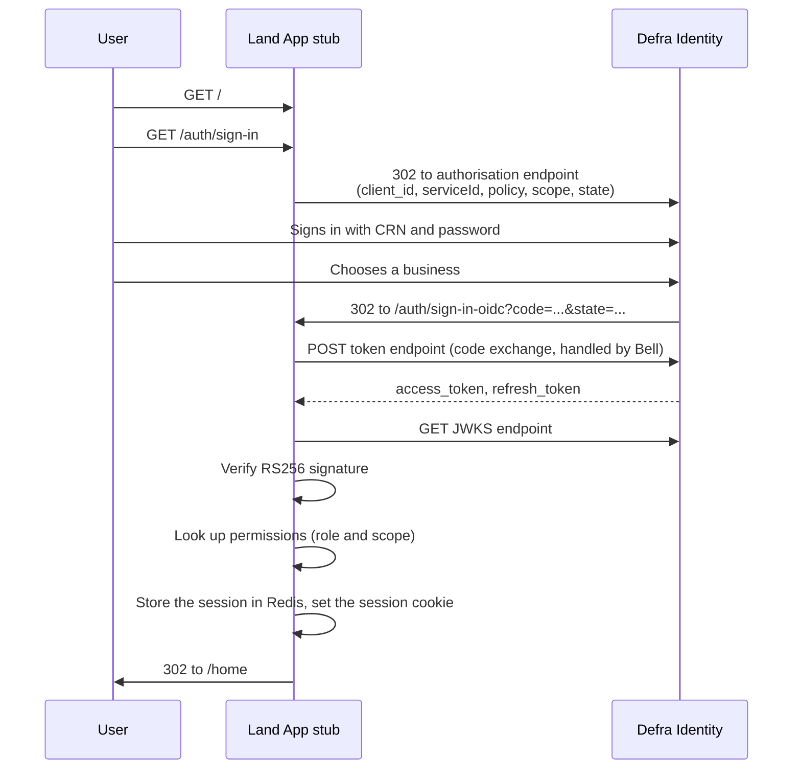

# fcp-land-app-stub

A stub of [The Land App](https://thelandapp.com/) that demonstrates how a third party
service integrates with **Defra Identity**.

The Land App is a commercial land management and mapping service used by farmers and
land agents. This repository is not the Land App: it is a deliberately small, readable
stand-in that implements the complete Defra Identity sign in journey so the Land App
team (and any other third party) has a working reference implementation to copy.

It is the third party sibling of [fcp-defra-id-example](https://github.com/DEFRA/fcp-defra-id-example),
which shows the same patterns for an internal Defra service. The difference is
presentational: because this stub represents a third party, it uses
[Bulma](https://bulma.io/) rather than the GOV.UK Design System.

> The source code, and in particular the comments in `src/auth/**` and
> `src/plugins/auth.js`, are the documentation. Read them alongside this README.

## Contents

- [What it does](#what-it-does)
- [Running it locally](#running-it-locally)
- [How the Defra Identity integration works](#how-the-defra-identity-integration-works)
  - [The sign in journey](#the-sign-in-journey)
  - [Two authentication strategies](#two-authentication-strategies)
  - [OpenID Connect discovery](#openid-connect-discovery)
  - [Verifying the token](#verifying-the-token)
  - [Getting permissions](#getting-permissions)
  - [The session](#the-session)
  - [Refreshing tokens](#refreshing-tokens)
  - [Changing organisation](#changing-organisation)
  - [Single sign on from another Defra service](#single-sign-on-from-another-defra-service)
  - [Signing out](#signing-out)
  - [Security notes](#security-notes)
- [Integration checklist](#integration-checklist)
- [Project structure](#project-structure)
- [Testing](#testing)
- [Debugging](#debugging)
- [Configuration](#configuration)
- [Deployment](#deployment)
- [SonarQube Cloud](#sonarqube-cloud)
- [Licence](#licence)

## What it does

Three pages and five auth routes:

| Page | Route | Description |
|---|---|---|
| Landing page | `GET /` | Public. Offers a "Sign in with Defra account" link. |
| Session details | `GET /home` | Requires the `user` scope. Lists everything held in the session, with links to change organisation and sign out. |
| Health check | `GET /health` | Public. Used by the platform. |

| Auth route | Description |
|---|---|
| `GET /auth/sign-in` | Starts the Defra Identity journey. |
| `GET /auth/sign-in-oidc` | The redirect URI. Exchanges the code, verifies the token, creates the session. |
| `GET /auth/organisation` | Restarts the journey forcing the organisation selection screen. |
| `GET /auth/sign-out` | Clears the local session and redirects to Defra Identity to end the SSO session. |
| `GET /auth/sign-out-oidc` | The post logout redirect URI. Validates state and returns the user to the landing page. |

## Running it locally

Prerequisites: Node.js 24+ (use `nvm`), Docker.

```bash
nvm use
npm install
cp .env.example .env
npm run local
```

`npm run local` starts the dependency containers (Redis and
[fcp-defra-id-stub](https://github.com/DEFRA/fcp-defra-id-stub)) and then runs the app
host-native with hot reload. Open <http://localhost:3000>.

To start the dependencies and the app separately:

```bash
npm run services:up
npm run dev
```

To run everything, including the app, in Docker:

```bash
docker compose --profile app up
```

`fcp-defra-id-stub` stands in for Defra Identity locally. It reads `example.data.json`,
so you can sign in as any customer reference number (CRN) in that file. When you deploy,
point `DEFRA_ID_WELL_KNOWN_URL` at the real Defra Identity tenant and drop the stub from
your compose file.

Useful scripts:

| Script | Description |
|---|---|
| `npm run local` | Dependencies plus the app with hot reload |
| `npm run dev` | The app only, with hot reload |
| `npm run dev:debug` | As above with the Node inspector on 9229 |
| `npm run services:up` / `services:down` | Dependency containers |
| `npm run build:frontend` | Build client assets with Vite |
| `npm run lint` / `lint:fix` | Neostandard |
| `npm test` | Unit and integration tests with coverage |

## How the Defra Identity integration works

### The sign in journey



### Two authentication strategies

`src/plugins/auth.js` registers two strategies and they do different jobs.

| Strategy | Plugin | Used by | Purpose |
|---|---|---|---|
| `defra-id` | `@hapi/bell` | `/auth/sign-in`, `/auth/sign-in-oidc`, `/auth/organisation` | Talks OAuth2 to Defra Identity |
| `session` | `@hapi/cookie` | Everything else (it is the default) | Validates the local session on each request |

Only three routes use `defra-id`. Once the session exists, every subsequent request is
authenticated by the cookie strategy, which looks the session up in Redis. Do not put
`defra-id` on ordinary routes: it would send the user back to Defra Identity on every
request.

### OpenID Connect discovery

`src/auth/get-oidc-config.js` fetches the well known endpoint once, at plugin
registration. That single document supplies:

| Field | Used for |
|---|---|
| `authorization_endpoint` | Where to send the user to sign in |
| `token_endpoint` | Code exchange and token refresh |
| `jwks_uri` | Public keys for signature verification |
| `end_session_endpoint` | Signing out of the Defra Identity SSO session |

Never hard code these URLs. They differ per environment and can change.

### Verifying the token

Defra Identity signs its tokens with RS256. `src/auth/verify-token.js` fetches the JWK
from the JWKS endpoint, converts it to a PEM with Node's `createPublicKey`, and verifies
the signature. Do this on every sign in: a token you have not verified is just a string a
caller handed you.

The token payload carries the claims the service needs:

| Claim | Meaning |
|---|---|
| `contactId` | The customer reference number (CRN), the person |
| `currentRelationshipId` | The organisation (business) the user selected |
| `sessionId` | Defra Identity's session identifier, reused as the local session key |
| `firstName`, `lastName` | The user's name |
| `roles` | Role names only, without permission detail |

The Bell `profile` function in `src/plugins/auth.js` maps these onto friendlier names
(`crn`, `organisationId`, `name`) while keeping every original claim.

### Getting permissions

`roles` in the token contains role names but not the permission levels a service needs to
make authorisation decisions. Real services call the Siti Agri APIs, authenticated with
the Defra Identity token, to resolve them.

`src/auth/get-permissions.js` mocks those calls and returns hard coded values so the stub
runs without any Siti Agri access. The mocked responses match the real response shapes,
and the comments record the endpoints, methods and headers, so replacing the mocks with
real calls is a contained change.

It returns:

```js
{ role: 'Farmer', scope: ['user', 'Full permission - business'] }
```

The `scope` array is what Hapi route-level `auth: { scope: [...] }` checks against, which
is how `/home` is restricted.

### The session

Two stores, with different jobs:

| Store | Plugin | Segment | Holds |
|---|---|---|---|
| Authenticated session | `@hapi/catbox-redis` via `server.app.cache` | `session` | Token, refresh token, profile, role, scope |
| Temporary data | `@hapi/yar` | `session-temp` | CSRF state, the post sign in redirect |

Only a session identifier goes in the cookie. Tokens never leave the server. `maxCookieSize: 0`
forces Yar to use the server-side cache rather than packing data into the cookie.

The session cookie must be `SameSite=Lax`. With `Strict` the browser would withhold the
cookie on the redirect back from Defra Identity and the journey would fail.

### Refreshing tokens

The cookie strategy's `validate()` runs on every request. It decodes the stored access
token and checks the expiry with a 60 second tolerance for clock skew. If the token has
expired it calls `src/auth/refresh-tokens.js` and writes the new pair back to the cache.

Defra Identity refresh tokens are **single use**: each refresh returns a new refresh token
and invalidates the old one. Always persist the new one.

### Changing organisation

A user with more than one business needs to switch between them.
`GET /auth/organisation` restarts the Bell journey with `forceReselection=true`, which
makes Defra Identity show the organisation selection screen even though the user is
already signed in. The journey rejoins the service at `/auth/sign-in-oidc`, which
overwrites the session with the new organisation.

### Single sign on from another Defra service

When a user arrives from another Defra service that already knows which business they are
working on, that service appends `?ssoOrgId=<organisationId>`. The `sso` plugin
(`src/plugins/sso.js`) intercepts it on `onRequest`, strips the parameter to avoid a
redirect loop, and sends the user through `/auth/organisation` with
`relationshipId=<organisationId>`. Defra Identity then skips the selection screen and the
user lands on the right business.

### Signing out

Signing out has two halves: the local session and the Defra Identity SSO session.

1. `GET /auth/sign-out` drops the Redis entry, clears the cookie, then redirects to the
   `end_session_endpoint` with `post_logout_redirect_uri`, `id_token_hint` and `state`.
2. Defra Identity ends its own session and redirects to `GET /auth/sign-out-oidc`.
3. That route validates the `state` value, clears the session again as a failsafe, and
   returns the user to the landing page.

Clearing only the local session would leave the user signed in at Defra Identity, so the
next sign in attempt would silently reuse the old identity.

### Security notes

| Concern | Mitigation |
|---|---|
| CSRF on sign out | `createState()` / `validateState()` in `src/auth/state.js` |
| Open redirect | `getSafeRedirect()` in `src/utils/get-safe-redirect.js`, applied to every user-supplied redirect |
| Token leakage | Tokens live in Redis, never in the cookie |
| Back button after sign out | The `headers` plugin disables caching on every page except the landing page and assets |
| XSS | Content Security Policy of `'self'` only, with a per-request nonce for the single inline script tag |

## Integration checklist

What you need from Defra Identity onboarding, and where it goes:

| Value | Environment variable |
|---|---|
| Well known (discovery) URL | `DEFRA_ID_WELL_KNOWN_URL` |
| Client ID | `DEFRA_ID_CLIENT_ID` |
| Client secret | `DEFRA_ID_CLIENT_SECRET` |
| Service ID | `DEFRA_ID_SERVICE_ID` |
| Policy name | `DEFRA_ID_POLICY` |

You must also register two redirect URIs with Defra Identity and set them here:

| Redirect | Environment variable |
|---|---|
| Sign in | `DEFRA_ID_REDIRECT_URL`, for example `https://your-service/auth/sign-in-oidc` |
| Sign out | `DEFRA_ID_SIGN_OUT_REDIRECT_URL`, for example `https://your-service/auth/sign-out-oidc` |

Then:

- [ ] Request the `openid`, `offline_access` and `<client id>` scopes. The client ID scope
      is what makes Defra Identity issue an access token for your service.
- [ ] Send `serviceId`, `p` (the policy) and `response_mode=query` as provider parameters.
- [ ] Verify the token signature against the JWKS endpoint on every sign in.
- [ ] Store tokens server-side, keyed by `sessionId`.
- [ ] Set the session cookie to `SameSite=Lax` and `Secure` in production.
- [ ] Handle refresh tokens as single use.
- [ ] Implement `forceReselection` for change organisation.
- [ ] Implement `ssoOrgId` handling if users can arrive from other Defra services.
- [ ] End the Defra Identity session on sign out, not just your own.
- [ ] Validate `state` on the sign out redirect.
- [ ] Pass every user-supplied redirect through a safe redirect check.

## Project structure

```
src/
  index.js                  Entry point
  server.js                 Hapi server, plugin registration, Redis cache
  auth/
    get-oidc-config.js      OpenID Connect discovery
    verify-token.js         JWKS fetch and RS256 verification
    get-permissions.js      Mocked Siti Agri role and privilege lookup
    refresh-tokens.js       Single use refresh token exchange
    get-sign-out-url.js     End session URL construction
    state.js                CSRF state for the sign out redirect
  plugins/
    auth.js                 Bell and Cookie strategies
    session.js              Yar temporary session data
    sso.js                  ssoOrgId interception
    router.js               Route registration
    content-security-policy.js
    headers.js              Security and cache headers
  routes/                   index, home, health, auth
  views/                    Nunjucks templates using Bulma
  client/                   SCSS, JS and images built by Vite into .public/
  config/                   Convict schemas and Nunjucks setup
  common/helpers/           CDP plumbing: logging, tracing, pulse, secure context, proxy, errors
  utils/get-safe-redirect.js
```

## Testing

```bash
npm test                  # unit and integration with coverage
npm run test:unit         # unit only, no Docker needed
npm run test:integration  # integration only, needs Docker
npm run test:watch        # watch mode
```

Unit tests mock their dependencies. Integration tests use `server.inject()` against a real
Redis started by Testcontainers (`test/setup/global-redis.js`) and mock only the
OpenID Connect discovery document, so the whole plugin and route stack is exercised.

## Debugging

VS Code launch configurations are in [.vscode/launch.json](.vscode/launch.json):

- **Dev: run server** launches the server with the inspector attached.
- **Debug current test** opens the inspector on the active test file.
- **Docker: Attach to App (together)** attaches to the container on port 9000.

## Configuration

All configuration goes through Convict in [src/config](src/config). Never read
`process.env` directly.

| Variable | Default | Description |
|---|---|---|
| `PORT` | `3000` | Server port |
| `NODE_ENV` | `development` | Node environment |
| `REDIS_HOST` | `redis` | Redis host |
| `REDIS_PORT` | `6379` | Redis port |
| `REDIS_USERNAME` | | Redis ACL username (CDP environments) |
| `REDIS_PASSWORD` | | Redis password (CDP environments) |
| `REDIS_KEY_PREFIX` | `fcp-land-app-stub:` | Key prefix, isolates this service in a shared Redis |
| `USE_SINGLE_INSTANCE_CACHE` | `true` outside production | `false` connects as a cluster, as CDP's Elasticache requires |
| `REDIS_TLS` | `true` in production | Connect to Redis using TLS |
| `REDIS_TTL` | `86400000` | Session lifetime in milliseconds |
| `COOKIE_PASSWORD` | | Session cookie encryption key, at least 32 characters |
| `DEFRA_ID_WELL_KNOWN_URL` | | OpenID Connect discovery endpoint |
| `DEFRA_ID_CLIENT_ID` | | Client ID issued by Defra Identity |
| `DEFRA_ID_CLIENT_SECRET` | | Client secret issued by Defra Identity |
| `DEFRA_ID_SERVICE_ID` | | Service ID issued by Defra Identity |
| `DEFRA_ID_POLICY` | | Defra Identity policy name |
| `DEFRA_ID_REDIRECT_URL` | | Sign in redirect URI |
| `DEFRA_ID_SIGN_OUT_REDIRECT_URL` | | Sign out redirect URI |
| `DEFRA_ID_REFRESH_TOKENS` | `true` | Refresh expired access tokens automatically |
| `HTTP_PROXY` | | Outbound proxy, set by the platform |
| `ENABLE_SECURE_CONTEXT` | `true` in production | Load `TRUSTSTORE_` certificates |

## Deployment

The service runs on the Core Delivery Platform (CDP). The Dockerfile has `development`,
`production_build` and `production` stages and builds from the CDP Node.js parent image.
Health checks are served from `/health` via `hapi-pulse`, logs are ECS formatted in
production, and requests are traced through the `x-cdp-request-id` header.

## SonarQube Cloud

Instructions for setting up SonarQube Cloud can be found in [sonar-project.properties](./sonar-project.properties).

## Licence

THIS INFORMATION IS LICENSED UNDER THE CONDITIONS OF THE OPEN GOVERNMENT LICENCE found at:

<http://www.nationalarchives.gov.uk/doc/open-government-licence/version/3>

The following attribution statement MUST be cited in your products and applications when using this information.

> Contains public sector information licensed under the Open Government license v3

### About the licence

The Open Government Licence (OGL) was developed by the Controller of Her Majesty's Stationery Office (HMSO) to enable
information providers in the public sector to license the use and re-use of their information under a common open
licence.

It is designed to encourage use and re-use of information freely and flexibly, with only a few conditions.
